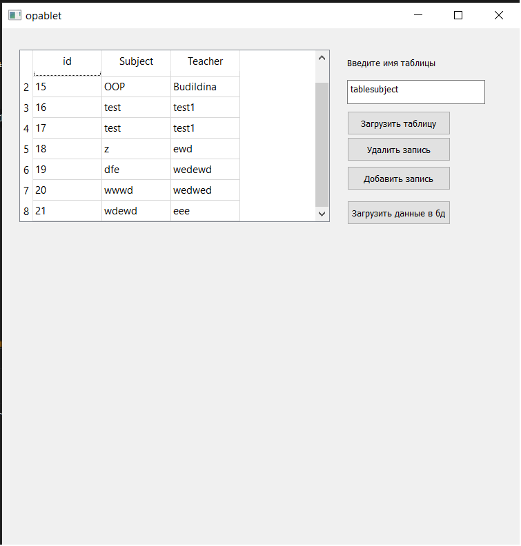

Проект в стадии разработки! 

v0.01
На данный момент есть возможность выводить на экран таблицу из удаленного сервера
А так же добавлять запись в нее

Приложение работает в 2 потока, 1 для графического интерфейса один для соединения с сервером

_________________________________________________________
update v0.02

Теперь моя писулька умеет  выгружать данные в таблицу, добавлять и удалять строки, а така же загружать измененную таблицу обратно на сервер.Так же наименования колонок подгружается с бд. То есть все функции работы с базой данных выполены. А именно

-Update

-Delete

-Show

-Add

так же изменен интерфес на человеческий

__________________________________________________

update v0.03

-теперь таблицы выбираются динамически

-динамически обновляются таблицы

-теперь можно добавлять неограниченое кол-во таблиц в бд и изменять любую из них (любой длинны и размерности) прямо из клиента!

